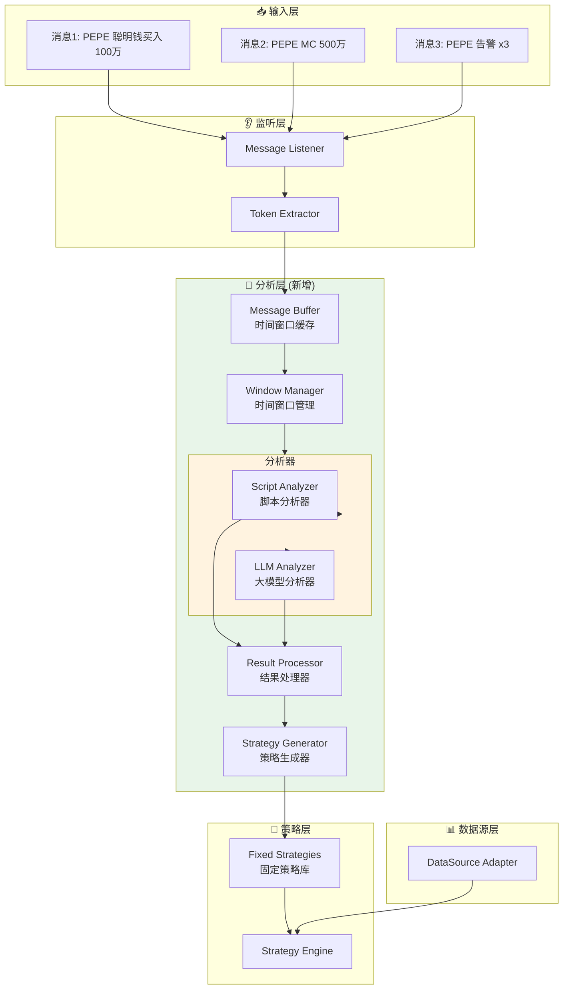
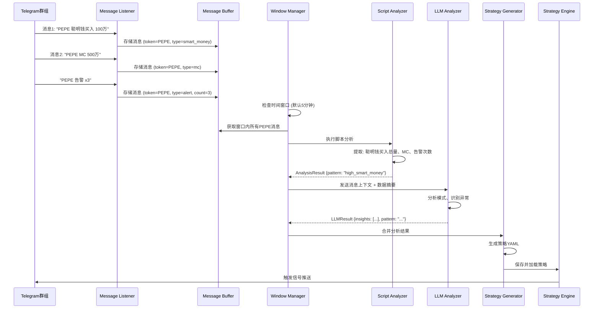

# 🧠 分析层设计方案

## 📋 需求概述

在数据监听和策略执行之间增加分析层，用于：
1. **时间窗口消息聚合**：收集指定时间段内的所有相关消息
2. **脚本分析**：使用Python脚本进行规则化分析
3. **大模型分析**：使用LLM进行智能分析，识别模式
4. **策略生成**：将分析结果转换为固定策略（YAML格式）
5. **策略持久化**：保存生成的策略供后续使用

## 🏗️ 架构设计



## 📊 数据流设计



## 🔧 核心组件设计

### 1. Message Buffer（消息缓冲区）

**职责**：
- 按Token分组存储消息
- 维护时间戳索引
- 支持时间窗口查询

**数据结构**：
```python
@dataclass
class MemeMessage:
    """Meme币推送消息结构"""
    token: str
    message_type: str  # "smart_money", "mc", "alert", "other"
    content: dict  # 结构化数据
    timestamp: datetime
    raw_text: str  # 原始消息文本
    
    # 结构化字段
    smart_money_amount: Optional[float] = None  # 聪明钱买入数量
    mc: Optional[float] = None  # 市值
    alert_count: Optional[int] = None  # 告警次数
    price: Optional[float] = None  # 价格（如有）
```

**接口**：
```python
class MessageBuffer:
    async def add_message(self, message: MemeMessage)
    async def get_window_messages(
        self, 
        token: str, 
        window_seconds: int = 300
    ) -> List[MemeMessage]
    async def get_token_summary(
        self, 
        token: str, 
        window_seconds: int
    ) -> TokenSummary
```

### 2. Window Manager（时间窗口管理器）

**职责**：
- 管理分析时间窗口（默认5分钟）
- 触发分析任务
- 聚合窗口内消息

**配置**：
```yaml
analysis:
  window_size: 300  # 5分钟
  min_messages: 2   # 最少消息数才触发分析
  max_messages: 50  # 最多分析消息数
  overlap: 60       # 窗口重叠秒数（滑动窗口）
```

### 3. Script Analyzer（脚本分析器）

**职责**：
- 执行Python脚本进行规则化分析
- 提取结构化数据（聪明钱、MC、告警等）
- 计算统计指标

**脚本接口**：
```python
# 分析脚本示例
def analyze(token: str, messages: List[MemeMessage]) -> AnalysisResult:
    """
    分析函数
    
    Args:
        token: Token符号
        messages: 时间窗口内的消息列表
        
    Returns:
        AnalysisResult: 分析结果
    """
    # 提取数据
    smart_money_total = sum(m.smart_money_amount for m in messages if m.smart_money_amount)
    mc_values = [m.mc for m in messages if m.mc]
    alert_counts = [m.alert_count for m in messages if m.alert_count]
    
    # 计算指标
    avg_mc = sum(mc_values) / len(mc_values) if mc_values else 0
    total_alerts = sum(alert_counts)
    
    # 识别模式
    pattern = None
    if smart_money_total > 1000000 and total_alerts >= 3:
        pattern = "high_smart_money_with_alerts"
    elif avg_mc < 1000000 and smart_money_total > 500000:
        pattern = "low_mc_high_smart_money"
    
    return AnalysisResult(
        token=token,
        pattern=pattern,
        metrics={
            "smart_money_total": smart_money_total,
            "avg_mc": avg_mc,
            "total_alerts": total_alerts,
            "message_count": len(messages)
        },
        confidence=0.8
    )
```

### 4. LLM Analyzer（大模型分析器）

**职责**：
- 使用大模型分析消息模式
- 识别异常和机会
- 生成策略建议

**Prompt设计**：
```
你是一个专业的加密市场分析师，专门分析Meme币的推送消息。

## 消息上下文（时间窗口：{window_start} - {window_end}）

Token: {token}

消息列表：
{formatted_messages}

## 数据摘要

- 聪明钱买入总量: {smart_money_total} USDT
- 平均市值: {avg_mc} USDT
- 告警次数: {total_alerts}
- 消息数量: {message_count}

## 分析任务

1. 识别消息中的模式和异常
2. 评估市场情绪和热度
3. 判断是否存在交易机会
4. 如果有明显模式，建议策略参数

## 输出格式（JSON）

{
  "pattern": "模式名称",
  "insights": ["洞察1", "洞察2"],
  "risk_level": "low|medium|high",
  "opportunity_score": 0-100,
  "strategy_suggestions": {
    "volume_threshold": 数值,
    "price_threshold": 数值,
    "conditions": ["条件1", "条件2"]
  }
}
```

### 5. Strategy Generator（策略生成器）

**职责**：
- 将分析结果转换为YAML策略
- 验证策略有效性
- 持久化策略

**转换逻辑**：
```python
class StrategyGenerator:
    def generate_from_analysis(
        self,
        analysis_result: AnalysisResult,
        llm_result: LLMResult
    ) -> StrategyConfig:
        """
        从分析结果生成策略
        
        1. 合并脚本分析和LLM分析结果
        2. 提取关键参数（阈值、条件）
        3. 生成YAML策略配置
        4. 验证策略有效性
        """
        
        # 提取参数
        volume_threshold = analysis_result.metrics.get("smart_money_total", 0)
        mc_threshold = analysis_result.metrics.get("avg_mc", 0)
        
        # 生成策略名称
        strategy_name = f"{analysis_result.pattern}_{analysis_result.token}"
        
        # 构建YAML策略
        strategy_yaml = {
            "name": strategy_name,
            "description": llm_result.insights[0] if llm_result.insights else "",
            "mode": "kline",
            "enabled": True,
            "conditions": [
                {
                    "field": "smart_money_buy",
                    "operator": ">",
                    "value": volume_threshold,
                    "description": f"聪明钱买入超过 {volume_threshold} USDT"
                },
                {
                    "field": "mc",
                    "operator": "<",
                    "value": mc_threshold * 2,  # 市值低于平均值的2倍
                    "description": f"市值低于 {mc_threshold * 2} USDT"
                }
            ],
            "signal_strength": {
                "formula": "min(100, (smart_money_buy / 10000) * 10)"
            }
        }
        
        return StrategyConfig(**strategy_yaml)
```

## 📝 消息解析设计

### Meme消息类型识别

```python
class MemeMessageParser:
    """解析Meme币推送消息"""
    
    PATTERNS = {
        "smart_money": [
            r"聪明钱.*?买入.*?(\d+(?:\.\d+)?)\s*(?:万|k|K|m|M)?",
            r"smart\s*money.*?buy.*?(\d+(?:\.\d+)?)",
            r"whale.*?buy.*?(\d+(?:\.\d+)?)"
        ],
        "mc": [
            r"MC[：:]\s*(\d+(?:\.\d+)?)\s*(?:万|k|K|m|M)?",
            r"市值[：:]\s*(\d+(?:\.\d+)?)\s*(?:万|k|K|m|M)?",
            r"market\s*cap[：:]\s*(\d+(?:\.\d+)?)"
        ],
        "alert": [
            r"告警\s*x?(\d+)",
            r"alert\s*x?(\d+)",
            r"警告\s*x?(\d+)"
        ]
    }
    
    def parse(self, text: str, token: str) -> MemeMessage:
        """解析消息"""
        # 识别消息类型并提取数据
        ...
```

## 🔄 工作流程

### 完整流程

```
1. 消息监听
   ↓
2. Token提取 + 消息解析
   ↓
3. 存入Message Buffer（按Token分组）
   ↓
4. Window Manager检查时间窗口
   ↓
5. 触发分析（满足条件时）
   ├─→ Script Analyzer（规则分析）
   └─→ LLM Analyzer（智能分析）
   ↓
6. 合并分析结果
   ↓
7. Strategy Generator生成策略
   ↓
8. 策略验证 + 持久化
   ↓
9. 加载到Strategy Engine
   ↓
10. 后续消息触发策略执行
```

### 触发条件

```yaml
analysis_triggers:
  # 时间窗口触发
  time_window:
    enabled: true
    interval: 300  # 每5分钟检查一次
    
  # 消息数量触发
  message_count:
    enabled: true
    threshold: 3  # 同一Token 3条消息触发
    
  # 关键事件触发
  key_events:
    enabled: true
    events:
      - "smart_money > 100万"
      - "alert_count >= 3"
      - "mc < 100万"
```

## 💾 数据存储

### 消息存储（Redis/内存）

```python
# Redis Key设计
messages:{token}:{timestamp}  # 消息存储
window:{token}:{window_id}   # 窗口索引
analysis:{token}:{timestamp} # 分析结果缓存
```

### 策略存储

```yaml
# 生成的策略保存到
config/strategies/generated/
  ├── {token}_{pattern}_{timestamp}.yaml
  └── active_strategies.yaml  # 当前激活的策略列表
```

## ⚙️ 配置示例

```yaml
analysis_layer:
  # 时间窗口配置
  window:
    size: 300  # 5分钟
    overlap: 60  # 1分钟重叠
    min_messages: 2
    max_messages: 50
    
  # 分析器配置
  analyzers:
    script:
      enabled: true
      script_path: "scripts/analyze_meme.py"
      timeout: 10  # 秒
      
    llm:
      enabled: true
      provider: "openai"  # openai, anthropic, gemini
      model: "gpt-4"
      temperature: 0.3
      max_tokens: 1000
      api_key: "${LLM_API_KEY}"
      
  # 策略生成配置
  strategy_generation:
    auto_enable: false  # 是否自动启用生成的策略
    min_confidence: 0.7  # 最低置信度
    validation: true  # 是否验证策略
    
  # 消息解析配置
  message_parsing:
    patterns_file: "config/message_patterns.yaml"
    fallback_llm: true  # 解析失败时使用LLM
```

## 🎯 使用场景示例

### 场景1：聪明钱大量买入 + 多次告警

**消息序列**：
```
10:00:00 - PEPE 聪明钱买入 200万
10:01:30 - PEPE MC 800万
10:02:15 - PEPE 告警 x3
10:03:00 - PEPE 聪明钱买入 150万
```

**分析结果**：
- Script: 聪明钱总量350万，告警3次，MC 800万
- LLM: "高聪明钱买入 + 多次告警，可能存在重大机会或风险"
- 生成策略: `high_smart_money_with_alerts_PEPE`

### 场景2：低市值 + 高聪明钱

**消息序列**：
```
10:05:00 - DOGE MC 50万
10:05:30 - DOGE 聪明钱买入 80万
```

**分析结果**：
- Script: MC 50万 < 100万，聪明钱80万 > MC
- LLM: "低市值但聪明钱大量买入，可能是早期机会"
- 生成策略: `low_mc_high_smart_money_DOGE`

## 📊 性能考虑

1. **异步处理**：分析任务异步执行，不阻塞消息接收
2. **缓存机制**：分析结果缓存，避免重复分析
3. **批量处理**：多个Token合并分析，提高效率
4. **限流控制**：LLM API调用限流，避免超限

## 🔐 安全考虑

1. **脚本沙箱**：脚本分析器在受限环境中执行
2. **输入验证**：LLM输入内容验证，防止注入
3. **策略验证**：生成的策略必须通过验证才能启用
4. **权限控制**：只有管理员可以启用自动生成的策略

