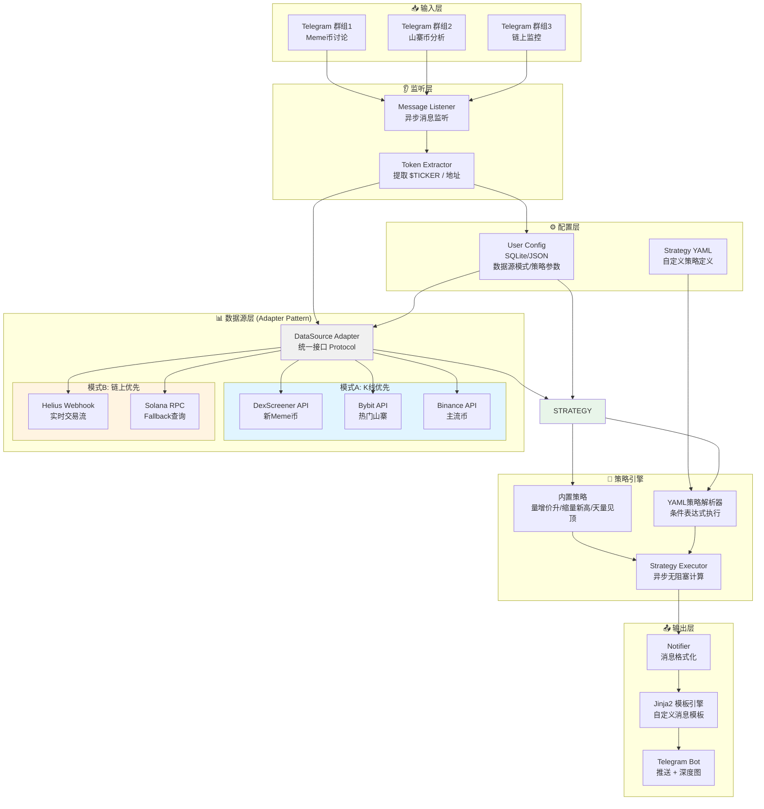
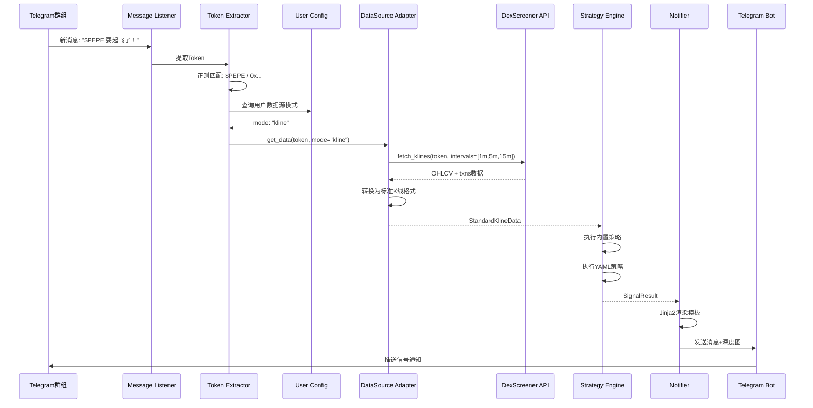
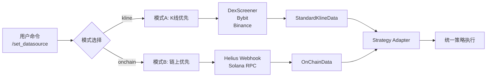

# 🏗️ Telegram 驱动型多源量价信号机器人 - 架构设计

## 📊 系统架构图



## 🔄 数据流图



## 🎯 模式切换点



## 📦 模块职责

| 模块 | 职责 | 延迟要求 |
|------|------|----------|
| **Listener** | 监听Telegram消息，异步处理 | < 1s |
| **Extractor** | 提取Token/地址，支持多种格式 | < 0.5s |
| **DataSource Adapter** | 统一数据接口，模式切换 | K线: ≤8s, 链上: ≤3s |
| **Strategy Engine** | 策略计算，支持内置+YAML | 异步无阻塞 |
| **Notifier** | 消息格式化，模板渲染 | < 1s |
| **Config Manager** | 配置持久化，用户设置管理 | 内存缓存 |

## 🔌 接口定义

### DataSource Adapter Protocol

```python
from typing import Protocol, Optional
from datetime import datetime
from enum import Enum

class DataSourceMode(Enum):
    KLINE = "kline"
    ONCHAIN = "onchain"

class StandardKlineData:
    """标准K线数据结构"""
    symbol: str
    interval: str  # 1m, 5m, 15m
    timestamp: datetime
    open: float
    high: float
    low: float
    close: float
    volume: float
    txns: Optional[int]  # 交易笔数

class OnChainData:
    """链上数据结构"""
    token_address: str
    timestamp: datetime
    buy_volume: float
    sell_volume: float
    total_volume: float
    price: float
    whale_addresses: list[str]
    wash_trading_flag: bool

class DataSourceAdapter(Protocol):
    """数据源适配器接口"""
    
    async def get_data(
        self,
        token: str,
        mode: DataSourceMode,
        intervals: list[str] = None
    ) -> StandardKlineData | OnChainData:
        """获取数据，返回统一格式"""
        ...
    
    async def is_available(self, token: str) -> bool:
        """检查数据源是否可用"""
        ...
```

## 🚀 性能指标

| 指标 | 目标值 |
|------|--------|
| K线模式延迟 | ≤ 8s |
| 链上模式延迟 | ≤ 3s (Webhook) |
| 策略计算时间 | < 100ms |
| 消息推送延迟 | < 1s |
| 并发处理能力 | 100+ tokens/min |

